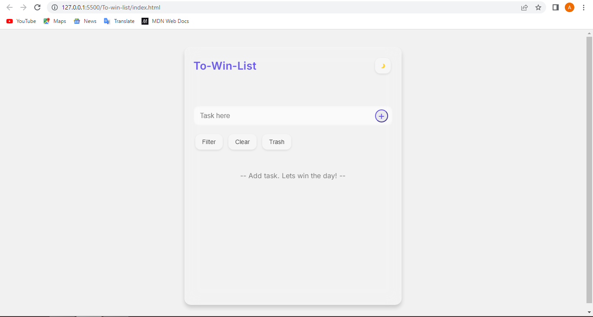
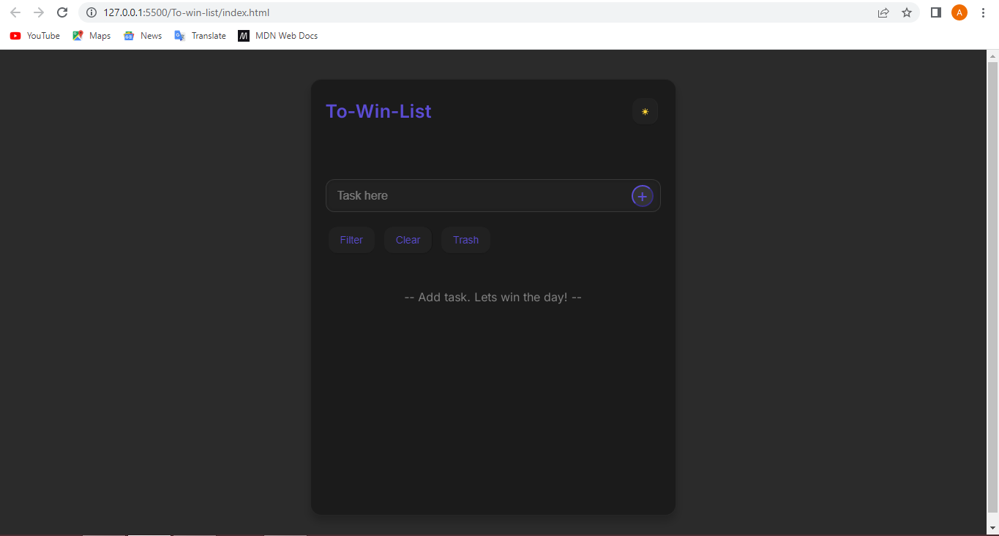

# ✨ To-win-list — A Minimalist Task Manager

**To-win-list** is a beautiful, minimalist task manager built for clarity and focus. It’s designed to help you win the day by organizing your tasks with intention, filtering by status, and even recovering deleted items from the trash. 

This is more than a to-do app — it’s your personal win-list.

---

## 🚀 Features

- ✅ Add, complete, and delete tasks
- 🗂️ Filter tasks by: All | Pending | Completed
- 🗑️ Move tasks to Trash and restore or permanently delete them
- ☀️🌙 Toggle between Light and Dark Mode (with theme persistence)
- 🎯 Sleek UI with **glassmorphism** and **obsidian purple** dark mode
- 💾 Tasks are saved automatically using `localStorage`

---

##  Demo

👉 [Live Website](https://loveson1.github.io/To-win-list)

---

##  Screenshots

| Light Mode | Dark Mode |
|------------|-----------|
|  |  |

---

## Tech Stack

- **HTML**
- **CSS** (with custom themes & animations)
- **JavaScript (Vanilla)**  
- `localStorage` for data persistence

